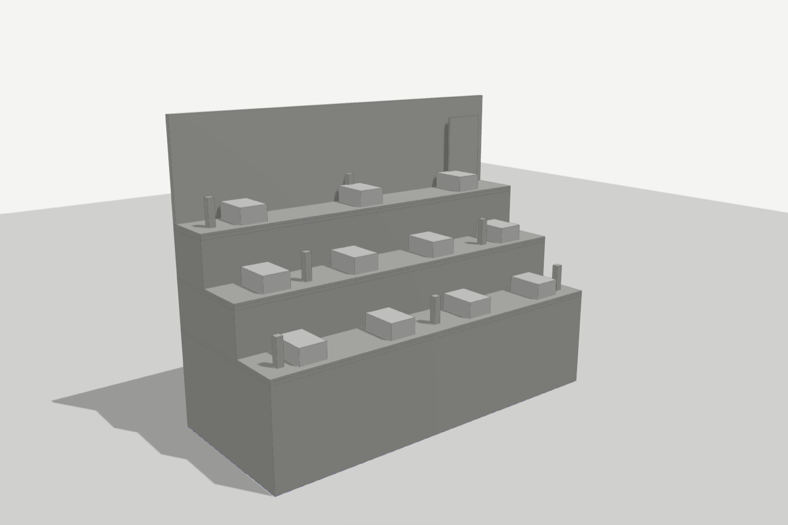
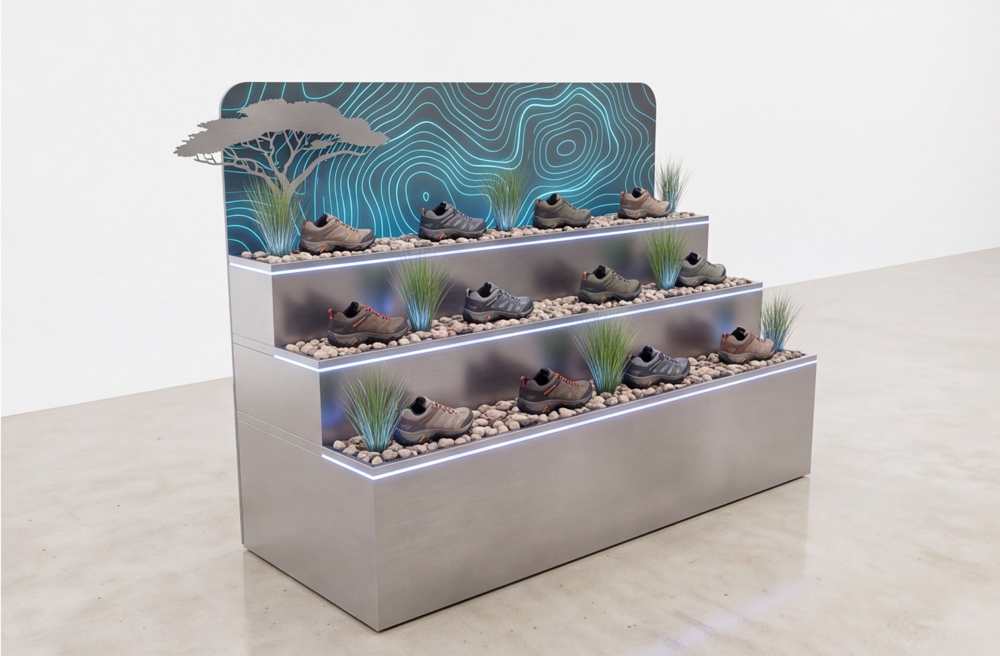
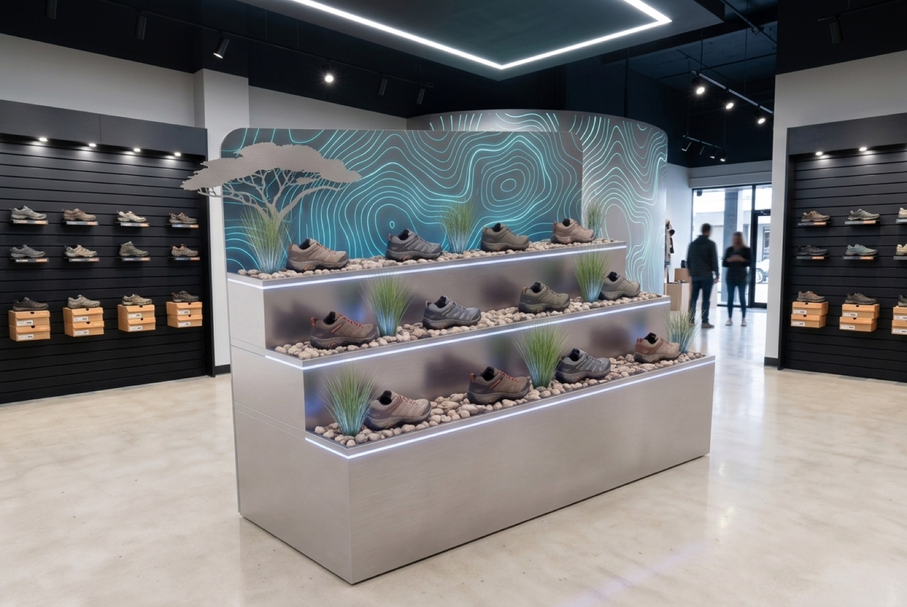
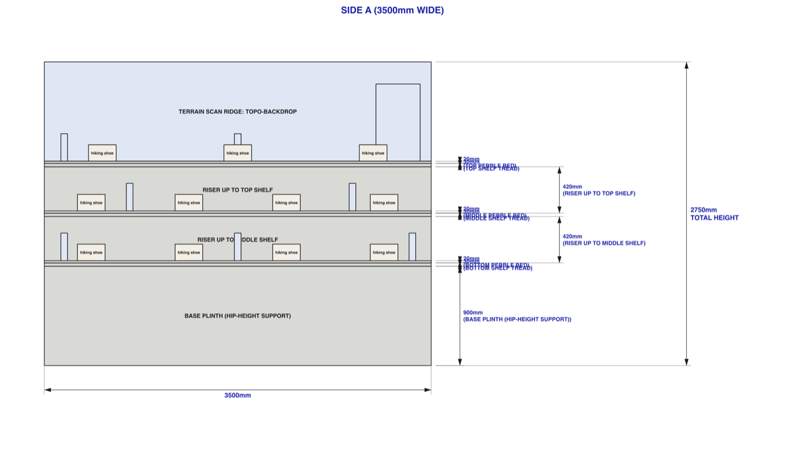

# Concept generator for Forming Reality

**A brief-to-client-deck pipeline for a shopfittings manufacturer.**
Sketches and a phone photo go in; a dimensioned 3D spec, photoreal renders, a
bill of materials and a PowerPoint come out. Live in production since September
2026.

`TypeScript · Three.js · Claude · Gemini · Fastify · Vite · Docker · Caddy`

---

## The problem

Forming Reality design and build retail display units — the fixtures you walk
past in a chemist or a shoe shop. Their business development lead would come
back from a client meeting with a sketch, some dimensions scribbled on a
drawing, and a photo of the unit currently on the shop floor. Turning that into
something he could show the client meant queueing for a designer. Days, usually,
for work that often changed again after the next call.

The ask was narrow and I kept it narrow: **let one salesperson produce a
credible concept himself, in an afternoon, without learning CAD.**

## What it does

**1 · Brief → dimensioned spec.** Upload the sketches, drawings and photos, add
a few lines of context. Claude reads them and produces a structured spec —
every part, every dimension, every material — plus up to three questions about
what it couldn't determine. The questions matter: the alternative is a model
that quietly invents a 150mm base frame.

**2 · Spec → block model.** The spec drives a Three.js scene rendered headlessly
from eight fixed cameras. Grey blocks, no materials. This is the geometric
source of truth.

**3 · Block model → painted render.** Gemini paints the block render, keeping
its geometry and viewpoint, applying the materials and product from the spec.

**4 · Placed in store.** The painted unit is composited into a described retail
environment.

**5 · Technical output.** Dimensioned elevations and plans as SVG, a bill of
materials with a weight estimate from per-material densities, and a client-ready
`.pptx`.

Throughout, he edits by typing what he wants in plain English — *"the shelf
is 25 thick, not 100"*, *"Side B crates run front to back"*. An adjustment
router turns that into a patch against the spec, re-renders, and verifies the
result against the instruction.

## What I actually learned

This is the part I'd want to talk about.

**Fix the inputs, not the adjectives.** Every time the renders drifted, my
instinct was to rewrite the prompt. It never worked. What worked, every single
time, was changing what the model was looking at:

- The model kept filling empty space under a table with invented storage
  trolleys. The cause was the floor grid in the block render — its lines showed
  through the void and read as shelving. Dropping the grid fixed it.
- Bags on a shelf rendered as a vague grey mass. Modelling them as rounded
  pillow geometry instead of thin slabs got the count exactly right.
- Passing a previous render as a "style reference" made the model reproduce that
  render's camera angle instead of the new one, no matter how explicitly the
  text said otherwise. Style references are off by default now; finish travels
  as words, not pictures.

**Multi-angle work goes through a contact sheet, always.** Painting each camera
angle separately produced four inconsistent units. Painting all four as a 2×2
grid in one generation, then splitting, gives matching finishes and lighting.
When I later added store placement as a per-angle path, it broke in exactly the
same way — so that went through the sheet too.

**Verify with a model, don't hope.** After every paint, a second model call
compares the block sheet against the painted sheet and names any panel whose
viewpoint turned. Stubborn panels get repainted alone with finish tiles taken
from the panels that came out right. I tried pixel-silhouette comparison first
and dropped it — block shadows made it unreliable.

**A regression I had to undo.** I once shipped a stricter per-part checklist for
the verifier and fed its verdict back into the next attempt. Both made things
worse: the checklist rejected correct output as "added parts", and the feedback
made the painter over-correct — a long crate split into four boxes. I reverted
both. Knowing which of your clever ideas to remove is most of the job.

**Cost was a stakeholder requirement, not an afterthought.** The business owner
cared about per-unit API spend from day one. Usage is tracked per call against a
budget, with a Costs tab in the UI. A router call is about 10p; a verified paint
15–60p depending on retries.

## Shape of it

- **119 commits over 10 days** to the first production deploy, then continued
  iteration against real client briefs.
- **~10,800 lines of TypeScript** across a `server` / `shared` / `web` monorepo.
- **16 real units built** against live client briefs across footwear, fashion,
  beauty and food retail.
- **A regression eval** over 11 router cases, runnable against fixture units, so
  prompt and model changes can be measured rather than guessed at.
- Deployed with Docker Compose behind Caddy on a VPS, protected by HTTP basic
  auth, updated with a `git pull` and a rebuild.

## Where it fell short

Parts that occupy only a few pixels in the block render — a 20mm branding strip,
a small price wedge — are below what the image model reliably honours. Six-plus
samples didn't fix it. At that point the honest answer to the client is "this
one needs a designer", not another £1.50 of retries.

---

*Built for Forming Reality. Source is private.*
