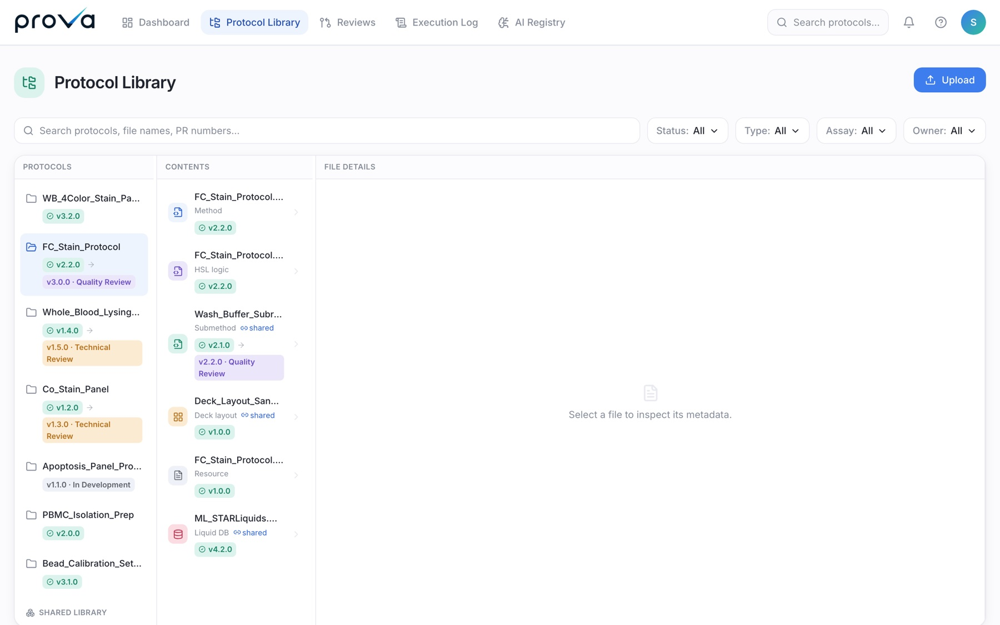
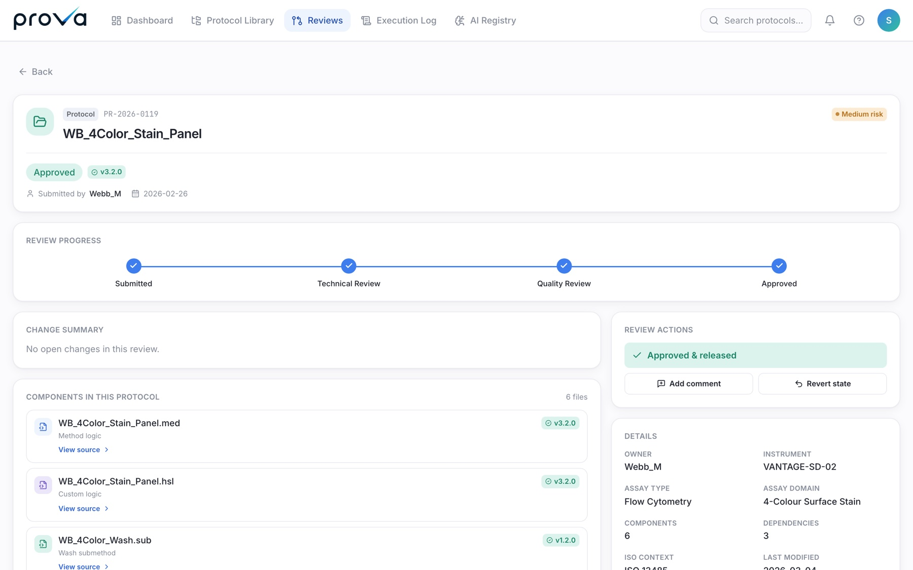
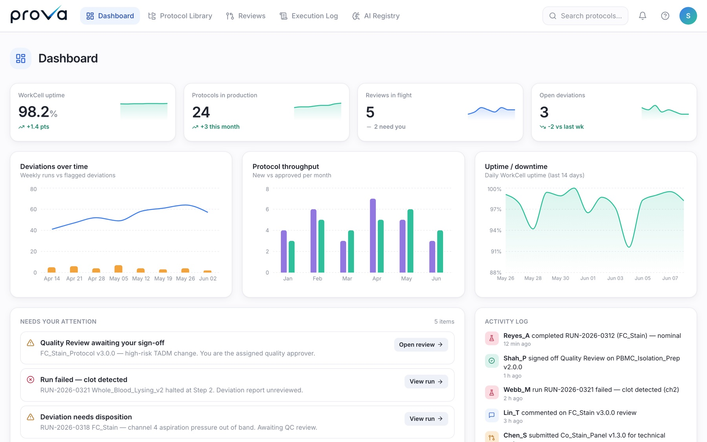
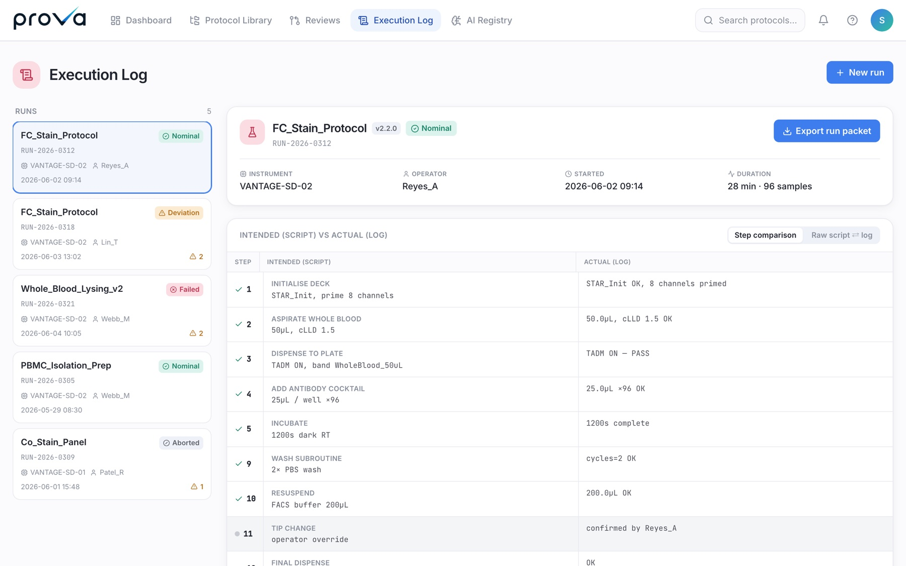
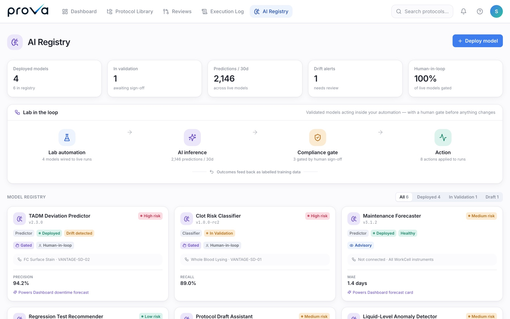

# Prova

**Version control and QA review for lab-automation scripts.**
An interactive demo built to open a design partnership with Waters Corp's R&D
reagents team.

`React · TypeScript · Vite · Tailwind · Recharts`

---

## The problem

Labs running Hamilton Venus automation have no version control for their
scripts. Not "bad version control" — none. A protocol is a bundle of binary
`.med`, `.hsl` and `.sub` files sitting on a workstation. There is no diff, no
history, no review trail, and no way to see which protocols share a submethod
that somebody just edited.

That matters more than it sounds. These labs work to ISO 13485. Validation is
slow and formal, so changes get made on the fly and never recorded — which is
precisely the gap an auditor finds. And when a run deviates, tracing it back
from the execution log to the script that caused it is a manual hunt that takes
anywhere from five minutes to four hours.

General-purpose AI tools can't help here, because they can't read a Hamilton
script. That's the wedge.

## What I built

Five modules, built in the order a user would meet them.

**Protocol Library** — every protocol and the files inside it, with version
state and review status. Scripts live in DEV, TEST or PROD; shared submethods
are tracked separately from protocol-owned ones, with a coupling map showing
which protocols depend on what.

**Reviews** — a technical-then-quality review flow with a change summary and a
risk classification. The point of the whole product is on this screen: a change
contained within the staining process is classified as needing no new
performance qualification, which is the difference between a two-day change and
a year-long revalidation.

**Dashboard** — uptime, protocols in production, reviews in flight, open
deviations.

**Execution Log** — runs with their deviations, linked back to the script
version that produced them.

**AI Registry** — the forward-looking module: which models are in use, for what,
and with what validation status. In a GxP environment an unregistered model in
a decision path is a finding.

## Approach

**The demo is the discovery document.** Everything in it is specific — real
Hamilton file types, a real flow-cytometry panel, a realistic 40µL-versus-4µL
dispense deviation seeded into the execution log. Generic demo content invites
generic feedback. Specific content gets you corrected, which is what you
actually want from a prospect.

**One screen at a time, reviewed before the next.** Not a big reveal at the end.

**No invented values.** At one point the design called for full six-file
packages across four protocols, which would have meant fabricating nine
checksums and file lengths. I didn't. The screen was rebuilt to run on the data
I could actually justify, with an explicit "pending validation" note where the
real numbers weren't available. In a regulated-industry demo, a plausible
invented checksum is worse than a visible gap.

**Design borrowed deliberately.** The visual language follows a clinical-SaaS
reference the customer already uses, so it reads as a tool from their world
rather than a prototype.

## Shape of it

- **~9,500 lines of TypeScript and TSX**, five modules, routed detail pages for
  protocols, components and models.
- A single shared data module drives the Library, Dashboard, Reviews and
  Execution Log, so counts and states stay consistent across screens.
- Static build, deployed to Vercel so the customer's team could walk it
  unattended.

---

*Built for a design-partnership pitch to Waters Corp. Source is private, and
the content of the discovery call it was based on is not reproduced here.*
